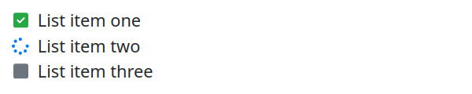

# Font Awesome Quarto Extension


This Quarto extension enables the use of Font Awesome icons within
Quarto documents using shortcodes. It supports standalone icons,
icon-based lists, and custom styling options.

## Installation

    quarto add dsjlu/quarto-fa

## Usage

### Standalone Icons

To insert a Font Awesome icon in your Quarto document, use:

```

```


#### Available Parameters:

- `group`: Icon group (e.g., `solid`, `brands`, `regular`). Default is
  `solid`.
- `color`: Hex color code for the icon (e.g., `#ff5733`).

### Icon Lists

Create unordered lists with icons as bullets using:

```

   List item one 
   List item two 
   List item three 

```



#### Explanation:

- `fa-ul`: Opens an unordered list with `fa-ul` class.
- `fa-li`: Adds an item with an icon from Font Awesome. (Optional
  styling attributes: `color`, `group`)
